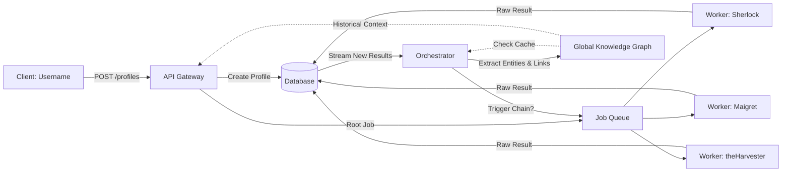

# System Architecture & Flow

## Overview
The OSINT API follows a distributed, asynchronous architecture designed to handle long-running intelligence gathering tasks without blocking client connections. The system is decomposed into four primary components: the **API Gateway**, **Job Queue**, **Worker Nodes**, and **Persistence Layer**. Additionally, it integrates with **External Payment Gateways** (PayPal, BTCPay) to support monetization.

## System Context

```mermaid
graph TD
    User[User / Developer]
    APIClient[OSINT Client App]
    
    subgraph "OSINT API Platform"
        Gateway[API Gateway]
        Billing[Billing Service]
        DB[(PostgreSQL DB)]
        Queue[Redis Queue]
    end
    
    subgraph "External Payment Providers"
        PayPal[PayPal Platform]
        BTCPay[BTCPay Server
(Self-Hosted)]
        Wallet[User's Crypto Wallet
(Optional)]
n    end
    
    %% Intelligence Flow
    User -->|1. Request Profile| APIClient
    APIClient -->|2. POST /profiles
 (w/ Credits)| Gateway
    Gateway -->|3. Verify Credits| Billing
    Billing -->|Deduct Credits| DB
    Billing -->|Allow Request| Gateway
    Gateway -->|4. Enqueue Job| Queue
    
    %% Payment Flow
    User -->|A. Buy Credits| APIClient
    APIClient -->|B. POST /credits/purchase| Gateway
    Gateway -->|C. Create Invoice| Billing
    Billing -->|D. Create Order| PayPal
    Billing -->|E. Create Charge| BTCPay
    PayPal -.->|F. Approval Link| APIClient
    BTCPay -.->|G. Checkout URL| APIClient
    User -->|H. Pay Fiat| PayPal
    User -->|I. Pay Crypto| Wallet
    Wallet -->|J. Send BTC| BTCPay
    PayPal -.->|K. Webhook: Paid| Billing
    BTCPay -.->|L. Webhook: Settled| Billing
    Billing -->|M. Add Credits| DB
```

## Component Diagram

```mermaid
graph TD
    Client[Client Application]
    Gateway[API Gateway]
    Auth[Auth Service (OAuth2 / API Key)]
    Queue[Job Queue (Redis)]
    Worker1[Worker Node 1]
    Worker2[Worker Node 2]
    WorkerN[Worker Node N]
    DB[(Database (PostgreSQL))]

    Client -->|HTTPS| Gateway
    Gateway -->|Validate Token| Auth
    Auth -->|Valid| Gateway
    Gateway -->|Push Job| Queue
    Queue -.->|Poll| Worker1
    Queue -.->|Poll| Worker2
    Queue -.->|Poll| WorkerN
    Worker1 -->|Update Status| DB
    Worker2 -->|Update Status| DB
    WorkerN -->|Update Status| DB
    Gateway -->|Query Status| DB
    DB -->|Return Data| Gateway
    Gateway -->|JSON Response| Client
```

### Component Descriptions

| Component | Responsibility | Technology Stack |
| :--- | :--- | :--- |
| **API Gateway** | Handles HTTP requests, enforces authentication/authorization (OAuth2 scopes), validates input schemas, and manages job submission/retrieval. | Python (FastAPI) / Node.js (Express) |
| **Job Queue** | Temporarily stores pending jobs and manages worker distribution. Supports priority queuing and delayed execution. | Redis (Bull / Celery) |
| **Worker Nodes** | Stateless processes that pull jobs from the queue, execute the specific OSINT tool (e.g., `sherlock`, `theHarvester`), and write results to the database. Horizontally scalable. | Python / Shell script wrappers |
| **Persistence Layer** | Stores user data, API keys, job metadata, and raw OSINT results. Enforces TTL for data retention. | PostgreSQL |

## Request Lifecycle

The system employs an asynchronous pattern to handle requests that may take seconds to minutes to complete.

### 1. Job Submission (Intelligence Gathering)
1.  **Request:** Client sends `POST /v1/jobs` with a target (e.g., `username` or `email`) and requested tools.
2.  **Authentication:** Gateway validates the Bearer token or API Key and checks scopes (e.g., `osint:read`).
3.  **Validation:** Input is validated against the OpenAPI schema (e.g., E.164 format for phones).
4.  **Queuing:** A unique `job_id` (UUID) is generated. Job metadata is persisted to the `jobs` table with status `pending`. The job payload is pushed to Redis.
5.  **Response:** Gateway returns `202 Accepted` with a `Location` header pointing to `/v1/jobs/{job_id}`.

### 2. Job Execution
1.  **Polling:** An idle Worker Node polls the Redis queue for a new job.
2.  **Processing:** The Worker executes the designated OSINT tool against the target.
3.  **Result Storage:** Upon completion, the Worker updates the `jobs` table status to `completed` (or `failed`) and inserts structured results into the `job_results` table.

### 3. Result Retrieval
1.  **Polling/Callback:** Client polls `GET /v1/jobs/{job_id}` periodically.
2.  **Response:**
    *   If `status` is `pending`, Gateway returns `200 OK` with estimated wait time.
    *   If `status` is `completed`, Gateway returns `200 OK` with the full result set.
    *   If `status` is `failed`, Gateway returns `200 OK` with error details.

## Scalability Strategy

The system is designed for horizontal scalability to handle increased load from both users and the complexity of OSINT queries.

### Scaling Worker Nodes
*   **Mechanism:** Workers are stateless. New Worker containers can be added to the orchestration layer (e.g., Kubernetes/Docker Swarm) without code changes.
*   **Trigger:** Scaling is triggered by the `job_queue_depth` metric (see Monitoring Plan). If the queue depth exceeds a threshold (e.g., 100 jobs) for >5 minutes, the auto-scaler spins up additional worker replicas.
*   **Resource Containment:** Each Worker is constrained by CPU/Memory limits to prevent a runaway OSINT process from starving the host.

### Scaling the API Gateway
*   **Mechanism:** The Gateway is a stateless REST service. It sits behind a Load Balancer.
*   **Read-Heavy Optimization:** Job result retrieval is a read-heavy operation. Database read replicas can be introduced to offload the primary instance.

### Database Scaling
*   **Strategy:** Start with a single PostgreSQL instance. Scale vertically (larger instance) first.
*   **Data Archiving:** The TTL strategy (see Data Model) automatically purges old results, preventing unbounded table growth.

## Chaining & Resolution Engine

To support the monetization goal of creating "Full Profiles" from interconnected data points, the system introduces a **Graph Resolution Engine** on top of the base job queue.

### Concept: Identity Resolution
The core value proposition is not just running tools, but linking results. For example:
1.  Input: `username: "johndoe"`
2.  Tool `sherlock` finds: `twitter.com/johndoe`
3.  Tool `social-analyzer` scrapes Twitter and finds: `email: "j.doe@company.com"`
4.  **Chain Trigger:** System detects a new high-value entity (Email).
5.  **Auto-Expansion:** System automatically queues a new job for `email: "j.doe@company.com"` using tools `holehe` or `theHarvester`.
6.  **Result:** A unified `Profile` object linking `Username`, `Twitter`, `Email`, and `Domain` data.

### Component: Billing Service
Manages the lifecycle of credit purchases and balance updates. This service handles integrations with PayPal (Fiat) and BTCPay Server (Decentralized Crypto).

#### Payment Flow
1.  **Purchase Request:** User sends `POST /v1/credits/purchase` specifying `payment_method: "paypal"` or `"bitcoin"`.
2.  **Invoice Creation:** Billing Service creates a record in `invoices` table with status `pending`.
3.  **Provider Redirection:**
    *   **PayPal:** API returns a PayPal checkout link.
    *   **BTCPay:** Billing Service calls BTCPay API to create an invoice. BTCPay returns a hosted checkout URL.
4.  **Payment Execution:** User pays. In the BTCPay flow, funds go **directly** to the configured hot wallet (non-custodial).
5.  **Webhook Callback:**
    *   **PayPal:** Sends IPN to `/webhooks/paypal`.
    *   **BTCPay:** Sends webhook to `/webhooks/btcpay` when the invoice status changes to `Settled` (after confirmations).
6.  **Verification:** Billing Service verifies the webhook signature (HMAC) to ensure the request came from the trusted gateway.
7.  **Credit Issuance:** If valid, `invoices` status -> `completed`, and `user_credits` balance is incremented.

### Component: Orchestrator
A new service, the **Orchestrator**, sits alongside the API Gateway and Workers.

*   **Responsibility:** Consumes raw `JobResults`, extracts "entities" (emails, phones, usernames), and determines if further investigation (chaining or re-evaluation) is merited.

#### 1. Tool Capability Registry
The Orchestrator maintains a registry defining which inputs each tool supports. This enables dynamic tool selection when new data is discovered.

| Tool | Acceptable Input Types |
| :--- | :--- |
| `sherlock` | `username`, `email` |
| `maigret` | `username` |
| `theHarvester` | `domain`, `email` |
| `holehe` | `email` |

#### 2. Re-evaluation Logic (Stateful Chaining)
When a `JobResult` returns a new entity (e.g., `email: "j.doe@corp.com"`), the Orchestrator performs a **Re-evaluation Loop**:

1.  **Check Depth:** `current_depth + 1` <= `profile.max_depth`.
2.  **Identify Candidates:** Query the Tool Capability Registry for all tools supporting the entity type (e.g., all tools supporting `email`).
3.  **Deduplication:** For each candidate tool, query the `jobs` table: `Has this tool already run on this specific entity within this Profile?`
    *   **If No:** Queue a new job for the tool targeting the entity.
    *   **If Yes:** Do nothing (prevent redundant execution).

This ensures maximum coverage. If `sherlock` runs initially on a username and finds nothing, but later the system discovers the user's email, `sherlock` is automatically re-run against the email.

#### 3. Entity Normalization & State Tracking
To effectively "track inputs and outputs," the Orchestrator performs **Entity Normalization** on raw tool results before entering the re-evaluation loop:

*   **URL -> Domain:** Converts `http://blog.example.com/post/1` to `example.com`.
*   **Whitespace Stripping:** Ensures `" johndoe "` becomes `"johndoe"`.
*   **Type Tagging:** Assigns a `target_type` (e.g., `email`, `domain`) based on regex patterns.

Once normalized, the entity is checked against the **State Graph** (an in-memory cache for the active profile) to ensure it hasn't been processed before triggering the Re-evaluation Loop defined above.
### Updated Data Flow with Knowledge Graph Persistence



#### Global Knowledge Graph Persistence
To support cross-subject relationship building, the Orchestrator performs two writes for every `JobResult`:

1.  **Ephemeral Write:** Stores the full raw JSON result in `job_results` (TTL: 7 days) for immediate user retrieval and debugging.
2.  **Persistent Write:** Extracts unique entities and links, normalizes them, and upserts them into the global `Entities` and `EntityRelationships` tables.

**Impact on Resolution:** Before queueing a new tool, the Orchestrator queries the Knowledge Graph. If the relationship between `Input A` and `Entity B` is already known and verified (high confidence score), the tool execution may be skipped or marked as "Cached", saving time and resources.

### Monetization Strategy: Profile Tiers

| Feature | Free Tier | Pro Tier | Enterprise Tier |
| :--- | :--- | :--- | :--- |
| **Max Depth (Hops)** | 0 (Root Only) | 1 (1-hop connections) | 3 (Full Graph) |
| **Auto-Expansion** | Disabled | Enabled (Emails/Domains) | Enabled (All Entities) |
| **Profile Retention** | 24 Hours | 7 Days | 30 Days |

## References
*   **API Contract:** `/a0/usr/projects/osint-api/.a0proj/osint-api-spec.yaml`
*   **Rationale:** `/a0/usr/projects/osint-api/.a0proj/design-rationale.md`